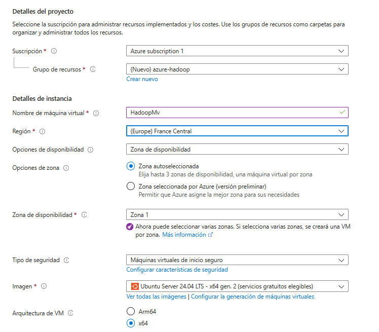
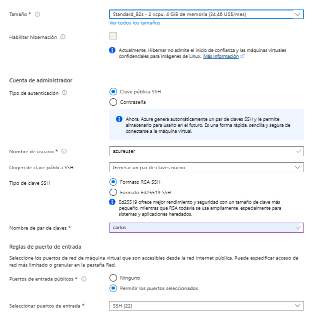
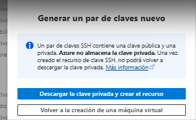

# Hadoop Docker Setup - WordCount Example

Este documento proporciona una guía para desplegar un clúster de Hadoop utilizando Docker y Docker Compose, y ejecutar el ejemplo de **WordCount** con MapReduce.

## Requisitos Previos

- **Cuenta en Azure** para crear una máquina virtual.
- **Docker** y **Docker Compose** instalados en tu sistema.
- Un directorio de trabajo donde estén todos los archivos necesarios, incluyendo `docker-compose.yml` y el archivo `hadoop-mapreduce-examples-3.2.1.jar`.

## Configuración de la Máquina Virtual en Azure

### 1. Crear una Máquina Virtual en Azure con Ubuntu 20.04 LTS

1. Accede al [Portal de Azure](https://portal.azure.com/) e inicia sesión.
2. Haz clic en "Crear un recurso" y selecciona "Máquina virtual".
3. Configura los detalles básicos de la máquina virtual:
   - **Grupo de recursos**: Crea uno nuevo o usa uno existente.
   - **Nombre de la VM**: Especifica un nombre, por ejemplo, `HadoopVM`.
   - **Región**: Selecciona la región de tu preferencia.
   - **Imagen**: Escoge "Ubuntu Server 20.04 LTS".
   - **Tamaño**: Selecciona un tamaño adecuado; `Standard_B2s` es suficiente para esta práctica.
   
   
4. Configura la autenticación con SSH:
   - **Nombre de usuario**: Por ejemplo, `azureuser`.
   - **Tipo de autenticación**: Selecciona "Clave pública SSH".
   - **Clave pública SSH**: Pega tu clave pública.
   
5. Revisa y crea la VM. 

### 2. Conectarse a la Máquina Virtual desde tu Terminal Local

Una vez creada la VM, conéctate a ella usando SSH:

```bash
ssh -i ruta/a/clave/descargada azureuser@<dirección_IP_pública_de_tu_VM>
```


Reemplaza `<dirección_IP_pública_de_tu_VM>` con la IP asignada a tu VM.

### 3. Instalar Docker y Docker Compose en la Máquina Virtual

1. **Actualizar paquetes e instalar Docker**:

   ```bash
   sudo apt update
   sudo apt install -y docker.io
   sudo systemctl start docker
   sudo systemctl enable docker
   ```

2. **Agregar tu usuario al grupo Docker**:

   ```bash
   sudo usermod -aG docker $USER
   ```

   Cierra sesión y vuelve a iniciar sesión para aplicar los cambios.

3. **Instalar Docker Compose**:

   ```bash
   sudo curl -L "https://github.com/docker/compose/releases/download/1.29.2/docker-compose-$(uname -s)-$(uname -m)" -o /usr/local/bin/docker-compose
   sudo chmod +x /usr/local/bin/docker-compose
   docker-compose --version
   ```

Este paso asegura que Docker y Docker Compose están configurados en la VM.

4. **Habilitar la salida o entrada de puertos **

   Redes > Configuracion de red >  Crear ACL del puerto

   


## Paso a Paso para Ejecutar el Ejemplo

### 1. Levantar el Clúster de Hadoop

Ejecuta el comando `sudo docker-compose up` para levantar los servicios del clúster de Hadoop. Utiliza el flag `-d` para ejecutarlos en segundo plano:

```bash
sudo docker-compose up -d
```

### 2. Verificar que los Servicios Están Corriendo

Asegúrate de que todos los servicios necesarios estén activos:

```bash
sudo docker ps
```

Deberías ver los contenedores `namenode`, `datanode1`, `datanode2`, `datanode3`, `resourcemanager`, `nodemanager`, y `historyserver` en la lista.

### 3. Configuración de Permisos en el Directorio de Trabajo

Si tienes problemas de permisos en el directorio de trabajo, asegúrate de que el usuario tenga permisos totales:

1. Cambia la propiedad del directorio:
   ```bash
   sudo chown -R $USER:$USER /ruta/a/tu/directorio
   ```

2. Otorga permisos de lectura, escritura y ejecución al usuario:
   ```bash
   chmod -R u+rwx /ruta/a/tu/directorio
   ```

Esto garantiza que puedes ejecutar los comandos sin necesidad de `sudo`.

### 3. Subir el Archivo de Entrada a HDFS

Primero, copia el archivo `archivo.txt` al contenedor del **NameNode**:

```bash
sudo docker cp archivo.txt namenode:/archivo.txt
```

Luego, crea los directorios necesarios en HDFS:

```bash
sudo docker exec -it namenode hdfs dfs -mkdir -p /user/Alumno_AI
```

Finalmente, sube el archivo a HDFS:

```bash
sudo docker exec -it namenode hdfs dfs -put /archivo.txt /user/Alumno_AI/
```

### 4. Ejecutar el Ejemplo de WordCount

Ejecuta el ejemplo de **WordCount** utilizando MapReduce. Esto contará las palabras del archivo que subiste a HDFS.

```bash
sudo docker exec -it resourcemanager yarn jar /opt/hadoop-3.2.1/share/hadoop/mapreduce/hadoop-mapreduce-examples-3.2.1.jar wordcount /user/Alumno_AI/archivo.txt /user/Alumno_AI/output
```

### 5. Verificar los Resultados

Para verificar los resultados del ejemplo de WordCount, puedes listar los archivos del directorio de salida en HDFS:

```bash
sudo docker exec -it namenode hdfs dfs -ls /user/Alumno_AI/output
```

Y luego ver el contenido del archivo de resultados:

```bash
sudo docker exec -it namenode hdfs dfs -cat /user/Alumno_AI/output/part-r-00000
```

## HDFS (Hadoop Distributed File System)

HDFS es el sistema de almacenamiento distribuido de Hadoop. Está diseñado para manejar grandes volúmenes de datos dividiéndolos en bloques y distribuyéndolos en múltiples nodos.

- **Distribución de Datos**: Los archivos se dividen en bloques (por defecto de 128 MB) y se distribuyen en diferentes nodos para mejorar la disponibilidad y la eficiencia.
- **Tolerancia a Fallos**: Cada bloque se replica (por defecto, 3 réplicas) para asegurar la disponibilidad en caso de fallo de un nodo.
- **Arquitectura Maestro-Esclavo**: Un **NameNode** administra la ubicación de los bloques, mientras que los **DataNodes** almacenan los bloques reales.

## MapReduce

MapReduce es un modelo de programación que permite el procesamiento paralelo de grandes volúmenes de datos. Está basado en dos fases principales: **Map** y **Reduce**.

- **Fase Map**: Divide la tarea en sub-tareas más pequeñas y paralelas. Cada sub-tarea procesa un bloque de datos y produce pares clave-valor.
- **Fase Reduce**: Toma los pares clave-valor producidos por las tareas de Map y las combina para producir resultados finales.

**Ejemplo**: En el ejemplo de **WordCount**, la fase **Map** divide el texto en palabras y las cuenta, mientras que la fase **Reduce** suma los conteos de cada palabra.

## YARN (Yet Another Resource Negotiator)

YARN es el componente de Hadoop encargado de la gestión de recursos y la planificación de tareas. Actúa como un sistema operativo para el clúster de Hadoop.

- **Gestión de Recursos**: Asigna recursos (CPU, memoria) a las aplicaciones que lo requieren.
- **Planificación de Tareas**: Distribuye y gestiona las tareas de diferentes aplicaciones (como MapReduce).
- **Componentes de YARN**:
  - **ResourceManager**: Coordina la asignación de recursos entre todas las aplicaciones del clúster.
  - **NodeManager**: Ejecuta las tareas en cada nodo y reporta al ResourceManager.
  - **ApplicationMaster**: Gestiona las tareas específicas de cada aplicación.

## Resolución de Problemas

### Error de Conexión Entre NameNode y DataNodes

- Asegúrate de que todos los contenedores estén conectados a la red **`shared_network`**.
- Verifica los logs del NameNode y DataNodes:
  ```bash
  docker logs namenode
  docker logs datanode1
  docker logs datanode2
  docker logs datanode3
  ```

### FileAlreadyExistsException

Si obtienes un error indicando que el directorio de salida ya existe, elimina el directorio de salida antes de volver a ejecutar el trabajo:

```bash
sudo docker exec -it namenode hdfs dfs -rm -r /user/Alumno_AI/output
```

## Limpieza

Para detener y eliminar todos los contenedores y redes:

```bash
sudo docker-compose down
```

Si deseas eliminar también los volúmenes:

```bash
sudo docker-compose down -v
```

## Notas Finales

- Asegúrate de que los **DataNodes** estén registrados correctamente en el **NameNode** antes de intentar subir archivos a HDFS.
- Puedes acceder a la interfaz web del NameNode en `http://ip_maquina:9870` para monitorear el estado del clúster.

